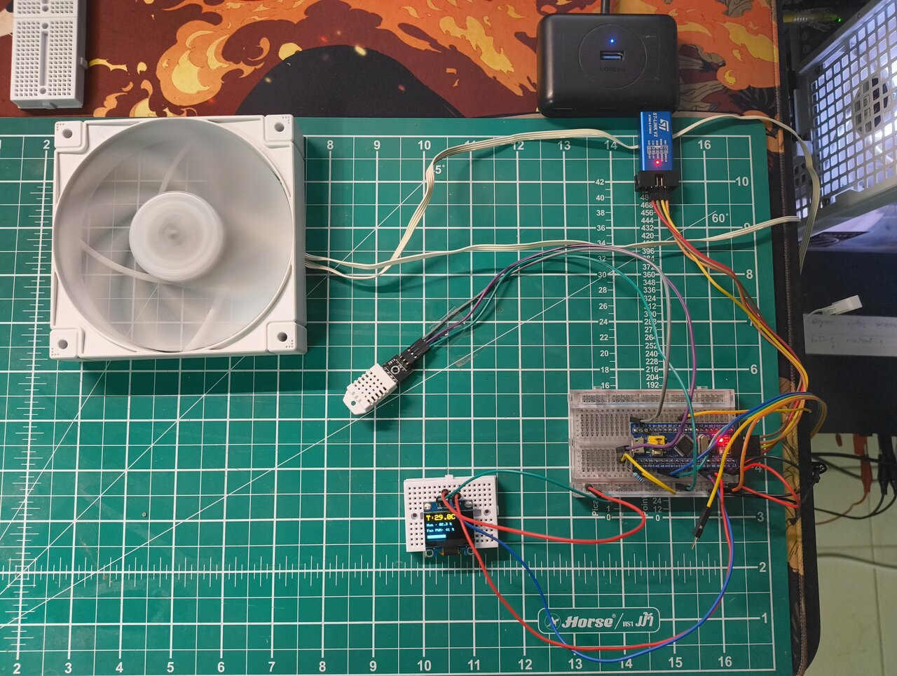
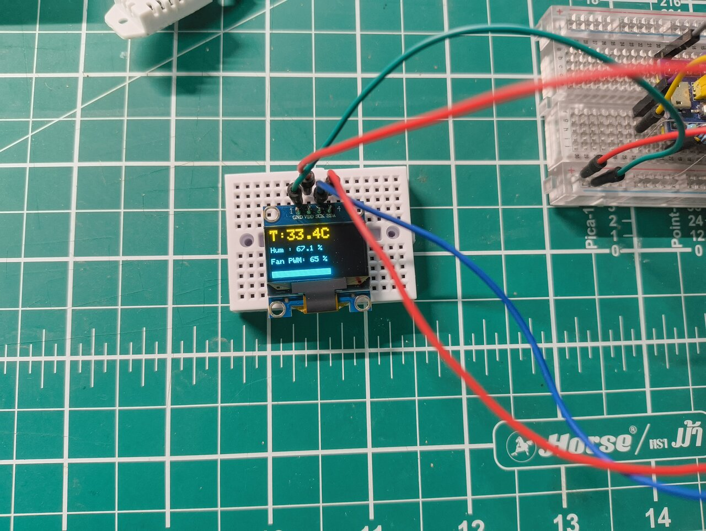
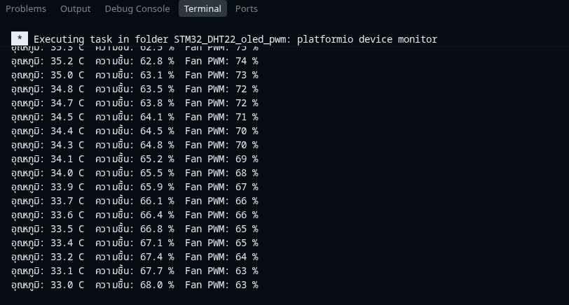

# STM32_DHT22_oled_pwm

ปรับความเร็วพัดลม 4-pin (PWM) อัตโนมัติตามอุณหภูมิจากเซนเซอร์ **DHT22**
พร้อมแสดงผลบน **Serial Monitor** และจอ **OLED 0.96" (SSD1306, I2C)**

บอร์ด: **STM32F103C8T6 (Blue Pill)** — อัปโหลดผ่าน **ST-Link V2 (SWD)**

---

## ✨ คุณสมบัติ

- อ่านอุณหภูมิ / ความชื้นจาก DHT22 ทุก 2 วินาที
- ปรับความเร็วพัดลมแบบ **เชิงเส้น** ตามอุณหภูมิ (25°C → 20%, 40°C → 100%)
- สร้างสัญญาณ PWM **25 kHz** ตามสเปกพัดลม 4-pin (Intel spec) ผ่าน hardware timer `TIM3_CH1`
- แสดงผลทั้ง **Serial Monitor (115200)** และ **จอ OLED** (อุณหภูมิ, ความชื้น, duty % + แถบความเร็ว)

---

## 🧰 อุปกรณ์ที่ใช้

| # | อุปกรณ์ | หมายเหตุ |
|---|---|---|
| 1 | STM32F103C8T6 (Blue Pill) | เชื่อมต่อ PC ผ่าน ST-Link V2 |
| 2 | ST-Link V2 | อัปโหลดผ่าน SWD |
| 3 | DHT22 | เซนเซอร์วัดอุณหภูมิ/ความชื้น |
| 4 | I2C OLED 0.96" | SSD1306 128x64 |
| 5 | พัดลม 4-pin PWM | 12V |
| 6 | Power supply 12V | จ่ายไฟให้พัดลม |

---

## 🔌 การต่อสาย (Wiring)

### ตารางขา

| อุปกรณ์ | ขา | ต่อกับ STM32 | หมายเหตุ |
|---|---|---|---|
| DHT22 | VCC | 3.3V | |
| DHT22 | DATA | **PB12** | ต้องมี pull-up 4.7k–10k ไป 3.3V |
| DHT22 | GND | GND | |
| OLED | VCC | 3.3V | |
| OLED | GND | GND | |
| OLED | SCL | **PB6** (I2C1_SCL) | |
| OLED | SDA | **PB7** (I2C1_SDA) | |
| พัดลม Pin1 (GND/ดำ) | | GND ของ 12V | ต้องต่อ GND ร่วมกับ STM32 |
| พัดลม Pin2 (12V/แดง-เหลือง) | | +12V | |
| พัดลม Pin3 (Tach/เขียว) | | — | ไม่ต้องต่อ (ไม่ได้อ่าน RPM) |
| พัดลม Pin4 (PWM/น้ำเงิน) | | **PA6** (TIM3_CH1) | สัญญาณ PWM 25kHz |

### ไดอะแกรม

```
     3.3V ──┬────────────── VCC (DHT22)
            │
           ┌┴┐
           │ │  R 4.7k-10k  (pull-up ของ DHT22)
           └┬┘
            │
 PB12 ──────┴────────────── DATA (DHT22)
 GND ────────────────────── GND (DHT22)

 PB6 ────────────────────── SCL (OLED)
 PB7 ────────────────────── SDA (OLED)

 PA6 ────────────────────── Pin4 PWM (พัดลม)

 GND  ───────────────────── Pin1 GND (พัดลม)
 +12V ───────────────────── Pin2 12V (พัดลม)
       (Pin3 Tach ไม่ต้องต่อ)
```

### ⚠️ ข้อควรระวัง

1. **GND ร่วม** — ต้องต่อ GND ของ STM32 เข้ากับ GND ของ 12V power supply ด้วย
   ไม่งั้นสัญญาณ PWM จะไม่ทำงาน
2. **Pull-up ของ DHT22** — ถ้าโมดูลไม่มีตัวต้านทานมาให้ ต้องต่อ R 4.7k–10k
   ระหว่าง DATA กับ 3.3V เอง
3. **ระดับไฟ PWM** — สเปก Intel กำหนด PWM เป็น 5V แต่ Blue Pill จ่าย 3.3V
   พัดลมหลายรุ่นยังหมุนได้ แต่ถ้าไม่ตอบสนอง ให้เพิ่ม NPN transistor (เช่น 2N2222)
   + R 1k คั่นระหว่าง PA6 → Pin4

### 📷 ภาพวงจรจริง

<p align="center">
  
  
</p>

---

## 💾 ซอฟต์แวร์ (Dependencies)

Library ทั้งหมดถูกประกาศใน `platformio.ini` (`lib_deps`):

| Library | เวอร์ชัน |
|---|---|
| Adafruit SSD1306 | ^2.5.7 |
| Adafruit GFX Library | ^1.11.9 |
| DHT sensor library | ^1.4.4 |
| Adafruit Unified Sensor | ^1.1.14 |

---

## 🚀 Build & Upload

```bash
# build
pio run

# อัปโหลดผ่าน ST-Link V2
pio run -t upload

# เปิด Serial Monitor (115200)
pio device monitor -b 115200
```

หรือใช้ GUI ของ VS Code + PlatformIO (กดปุ่ม Upload / Serial Monitor)

> **หมายเหตุ**: โปรเจกต์นี้ตั้ง `upload_protocol = stlink` ไว้แล้วใน `platformio.ini`

### 📺 ตัวอย่างผลลัพธ์จาก Serial Monitor

<p align="center">
  
</p>

---

## ⚙️ การตั้งค่า (Configuration)

ค่าทั้งหมดอยู่ด้านบนของ `src/main.cpp`:

```cpp
#define DHTPIN        PB12    // ขา data ของ DHT22
#define FAN_PWM_PIN   PA6     // ขา PWM ของพัดลม (TIM3_CH1)

#define PWM_FREQ_HZ      25000UL  // ความถี่ PWM พัดลม 4-pin

#define TEMP_MIN_C       25.0f    // อุณหภูมิเริ่มหมุน (°C)
#define TEMP_MAX_C       40.0f    // อุณหภูมิพัดลมเต็ม 100% (°C)
#define DUTY_MIN_PERCENT 20.0f    // duty ต่ำสุด (กันพัดลมกระตุก)
#define DUTY_MAX_PERCENT 100.0f   // duty สูงสุด

#define READ_INTERVAL_MS 2000UL   // ระยะอ่าน DHT22 (ms)
```

**การคำนวณ duty cycle** (เชิงเส้น):

- อุณหภูมิ ≤ 25°C → 20%
- อุณหภูมิ ≥ 40°C → 100%
- ระหว่าง 25–40°C → คำนวณเชิงเส้นตามช่วง

---

## 🛠️ Troubleshooting (ปัญหาที่พบบ่อย)

### 1. `Debug adapter doesn't support 'hla_swd' transport` ตอนอัปโหลด

OpenOCD เวอร์ชันใหม่ (0.12.0+) ยกเลิก transport แบบเก่า `hla_swd` ของ ST-Link
แต่สคริปต์ของ PlatformIO ยังสั่งค่านั้นอยู่

**วิธีแก้**: แก้ไฟล์ `~/.platformio/platforms/ststm32/platform.py` บรรทัด 205
เปลี่ยน `"hla_swd" if link == "stlink" else "swd"` เป็น `"swd"`

> ⚠️ การแก้อยู่ที่ไฟล์ของ PlatformIO เอง อาจถูกทับเมื่อ `pio platform update`

### 2. Serial Monitor ว่าง / ค้าง ไม่ขึ้นอะไรเลย

ST-Link V2 (SWDIO/SWCLK) ใช้แค่อัปโหลดโปรแกรม **ไม่ส่ง Serial**
ต้องต่อเส้นทาง UART แยก:

- ต่อ `PA9` (TX) และ `PA10` (RX) เข้ากับ USB-to-TTL adapter (CH340/FTDI/CP2102)
  หรือขา TX/RX ของ ST-Link V2 (ถ้ามี)
- ต่อแบบ **ไขว้กัน**: TX→RX, RX→TX และต่อ GND ร่วม

### 3. DHT22 อ่านไม่สำเร็จ (อ่านค่าเป็น `nan`)

- ตรวจสอบ pull-up 4.7k–10k ระหว่าง DATA กับ 3.3V
- ห้ามใช้ pull-up เกิน 10kΩ (สัญญาณจะขึ้นช้า)
- อย่าให้สาย DATA ยาวเกินไป / อย่าเดินใกล้สายไฟ 12V

---

## 📁 โครงสร้างโปรเจกต์

```
STM32_DHT22_oled_pwm/
├── platformio.ini        # คอนฟิกโปรเจกต์ + libraries
├── src/
│   └── main.cpp          # โค้ดหลักทั้งหมด
├── include/
├── lib/
├── test/
└── README.md
```

---

## 📝 License

MIT License — นำไปใช้ / ดัดแปลง / ต่อยอดได้อย่างอิสระ
