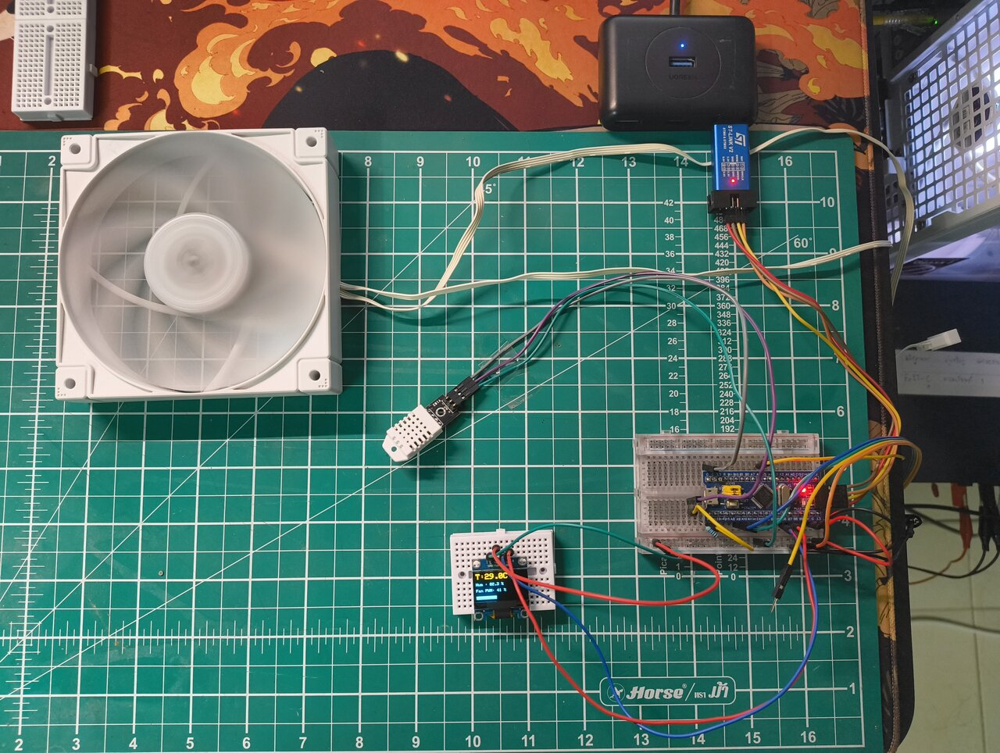
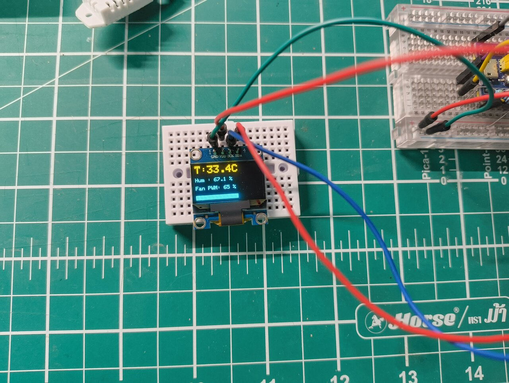
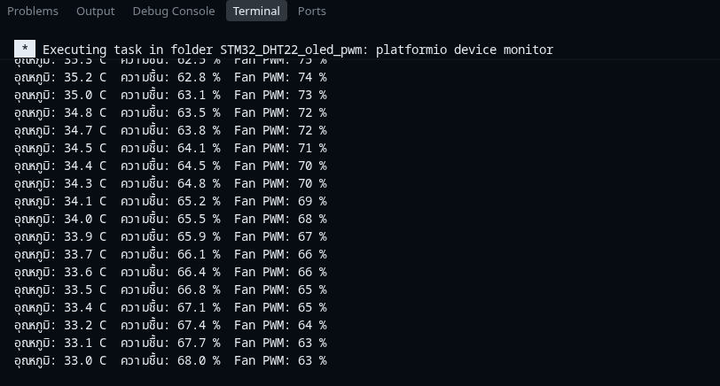

# STM32_DHT22_oled_pwm

Automatically controls the speed of a 4-pin (PWM) fan based on temperature
read from a **DHT22** sensor, with output on both the **Serial Monitor** and a
**0.96" OLED (SSD1306, I2C)**.

Board: **STM32F103C8T6 (Blue Pill)** — flashed via **ST-Link V2 (SWD)**

---

## Features

- Reads temperature / humidity from the DHT22 every 2 seconds
- Adjusts fan speed **linearly** with temperature (25°C → 20%, 40°C → 100%)
- Generates a **25 kHz** PWM signal (Intel 4-pin fan spec) via hardware timer `TIM3_CH1`
- Displays results on both the **Serial Monitor (115200)** and the **OLED** (temperature, humidity, duty % + speed bar)

---

## Hardware

| # | Component | Notes |
|---|---|---|
| 1 | STM32F103C8T6 (Blue Pill) | Connected to PC via ST-Link V2 |
| 2 | ST-Link V2 | Flashing via SWD |
| 3 | DHT22 | Temperature / humidity sensor |
| 4 | I2C OLED 0.96" | SSD1306 128x64 |
| 5 | 4-pin PWM fan | 12V |
| 6 | 12V power supply | Powers the fan |

---

## Wiring

### Pin table

| Component | Pin | STM32 pin | Notes |
|---|---|---|---|
| DHT22 | VCC | 3.3V | |
| DHT22 | DATA | **PB12** | Requires a 4.7k–10k pull-up to 3.3V |
| DHT22 | GND | GND | |
| OLED | VCC | 3.3V | |
| OLED | GND | GND | |
| OLED | SCL | **PB6** (I2C1_SCL) | |
| OLED | SDA | **PB7** (I2C1_SDA) | |
| Fan Pin1 (GND/black) | | 12V GND | Must share GND with the STM32 |
| Fan Pin2 (12V/red-yellow) | | +12V | |
| Fan Pin3 (Tach/green) | | — | Not connected (RPM not read) |
| Fan Pin4 (PWM/blue) | | **PA6** (TIM3_CH1) | 25 kHz PWM signal |

### Diagram

```
     3.3V ──┬────────────── VCC (DHT22)
            │
           ┌┴┐
           │ │  R 4.7k-10k  (DHT22 pull-up)
           └┬┘
            │
 PB12 ──────┴────────────── DATA (DHT22)
 GND ────────────────────── GND (DHT22)

 PB6 ────────────────────── SCL (OLED)
 PB7 ────────────────────── SDA (OLED)

 PA6 ────────────────────── Fan Pin4 PWM

 GND  ───────────────────── Fan Pin1 GND
 +12V ───────────────────── Fan Pin2 12V
       (Fan Pin3 Tach not connected)
```

### Important notes

1. **Common GND** — Connect the STM32 GND to the 12V power supply GND,
   otherwise the PWM signal will not work.
2. **DHT22 pull-up** — If your module has no built-in resistor, add a 4.7k–10k
   resistor between DATA and 3.3V yourself.
3. **PWM voltage level** — The Intel spec defines PWM as 5V, but the Blue Pill
   outputs 3.3V. Many fans still work; if yours does not respond, add an NPN
   transistor (e.g. 2N2222) + 1k resistor between PA6 and Pin4.

### Actual circuit photos

<p align="center">
  
  
</p>

---

## Dependencies

All libraries are declared in `platformio.ini` (`lib_deps`):

| Library | Version |
|---|---|
| Adafruit SSD1306 | ^2.5.7 |
| Adafruit GFX Library | ^1.11.9 |
| DHT sensor library | ^1.4.4 |
| Adafruit Unified Sensor | ^1.1.14 |

---

## Build & Upload

```bash
# build
pio run

# upload via ST-Link V2
pio run -t upload

# open the Serial Monitor (115200)
pio device monitor -b 115200
```

Or use the VS Code + PlatformIO GUI (Upload / Serial Monitor buttons).

> **Note**: This project already sets `upload_protocol = stlink` in `platformio.ini`.

### Serial Monitor output example

<p align="center">
  
</p>

---

## Configuration

All settings are at the top of `src/main.cpp`:

```cpp
#define DHTPIN        PB12    // DHT22 data pin
#define FAN_PWM_PIN   PA6     // fan PWM pin (TIM3_CH1)

#define PWM_FREQ_HZ      25000UL  // 4-pin fan PWM frequency

#define TEMP_MIN_C       25.0f    // temperature where the fan starts spinning (°C)
#define TEMP_MAX_C       40.0f    // temperature where the fan reaches 100% (°C)
#define DUTY_MIN_PERCENT 20.0f    // minimum duty (prevents fan stalling)
#define DUTY_MAX_PERCENT 100.0f   // maximum duty

#define READ_INTERVAL_MS 2000UL   // DHT22 read interval (ms)
```

**Duty cycle calculation** (linear):

- Temperature ≤ 25°C → 20%
- Temperature ≥ 40°C → 100%
- Between 25–40°C → linear interpolation over the range

---

## Troubleshooting

### 1. `Debug adapter doesn't support 'hla_swd' transport` on upload

Newer OpenOCD (0.12.0+) dropped the old `hla_swd` transport for ST-Link, but
PlatformIO's script still sends it.

**Fix**: Edit `~/.platformio/platforms/ststm32/platform.py` line 205 and change
`"hla_swd" if link == "stlink" else "swd"` to `"swd"`.

> This fix lives in PlatformIO's own files and may be overwritten by `pio platform update`.

### 2. Serial Monitor is empty / hangs

ST-Link V2 (SWDIO/SWCLK) is only used for flashing — it **does not carry
serial data**. You need a separate UART path:

- Connect `PA9` (TX) and `PA10` (RX) to a USB-to-TTL adapter (CH340/FTDI/CP2102)
  or to the TX/RX pins of your ST-Link V2 (if available).
- Connect **crossed**: TX→RX, RX→TX, and share GND.

### 3. DHT22 read fails (returns `nan`)

- Check the 4.7k–10k pull-up between DATA and 3.3V.
- Do not use a pull-up larger than 10kΩ (signal rises too slowly).
- Keep the DATA wire short and away from the 12V power wires.

---

## Project structure

```
STM32_DHT22_oled_pwm/
├── platformio.ini        # project config + libraries
├── src/
│   └── main.cpp          # main firmware
├── include/
├── lib/
├── test/
├── docs/                 # images used in this README
└── README.md
```

---

## License

MIT License — free to use, modify, and extend.
